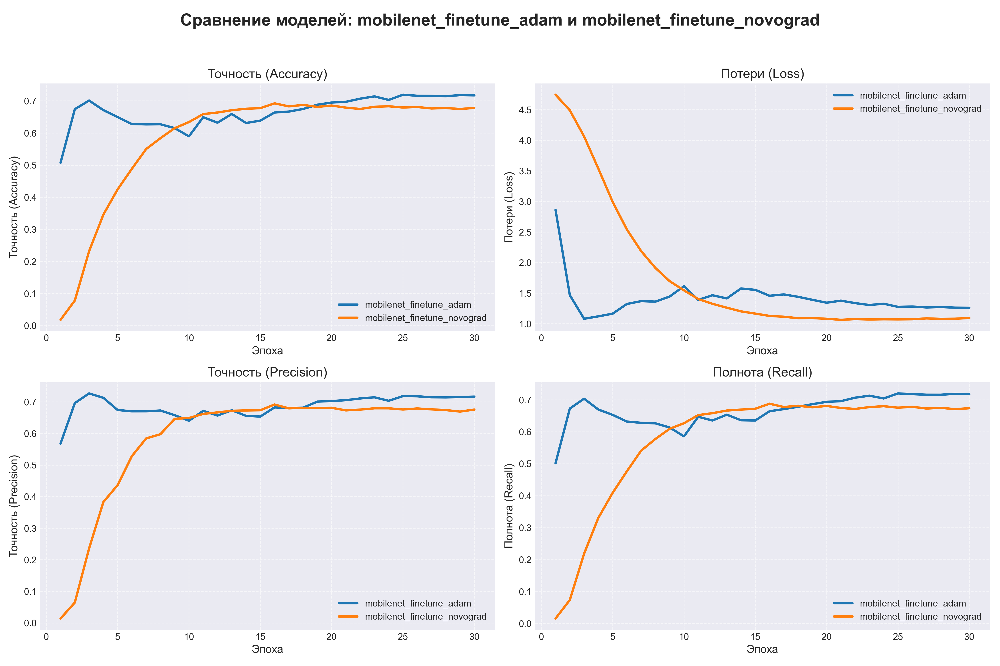
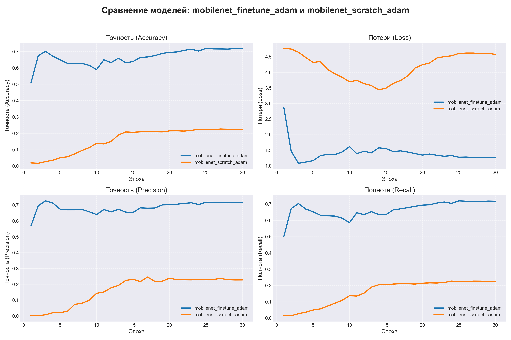

# Лабораторня работа 1
## Агишев, Алиева, Маскаев  группа 423
## MobileNet-V2

**************

### 1 Постановка задачи и цель проекта
Цель: Научиться реализовывать один из алгоритмов глубокого обучения
Задание:
1. Скачать датасет Stanford Dogs Dataset. Разделить датасет на обучающую, валидационную и тестовую выборки (70/15/15).
2. Реализовать нейронную сеть с архитектурой MobileNet-V2
3. Провести два типа экспериментов:
  a. Дообучение предобученной модели. Использовать предобученную модель. Провести обучение с оптимизатором Adam и с оптимизатором NovoGrad. Сравнить качество моделей (Precision, Recall).
  b. Обучение модели с нуля на Adam. Сравнить качество этой модели с результатами предобученной модели.
4. Сделать отчёт.

**************

### 2 Теоретическая база

#### Архитектура MobileNetV2

MobileNet V2 — это мощная и эффективная архитектура свёрточной нейронной сети, разработанная для мобильных устройств и встроенных систем машинного зрения.

Ключевые особенности:

• Инвертированные остаточные блоки: соединяют слои разной глубины, обеспечивая более эффективный поток информации и снижая вычислительную сложность.

• Линейные «узкие места»: помогают сохранять информацию, поддерживая низкоразмерные представления, что минимизирует потерю данных и повышает общую точность модели.

• Послойные разделяемые свёртки: этот метод разделяет свёртку на две отдельные операции: свёртку по глубине и точечную свёртку, что значительно снижает вычислительные затраты.

• Функция активации ReLU6: ограничивает выходное значение ReLU значением 6. Это помогает предотвратить численную нестабильность при вычислениях с низкой точностью, что делает модель более подходящей для мобильных и встраиваемых устройств

два типа базовых блоков MobileNetV2

#### Оптимизатор NovoGrad

Novograd — это адаптивный оптимизатор скорости обучения, который сочетает послойную нормализацию градиента с оценкой второго момента, как в алгоритме Adam.

Ключевое нововведение Novograd — вычисление второго момента для каждого слоя, а не для каждого веса, что обеспечивает более стабильное обучение и снижает потребление памяти. 
Градиенты нормализуются по L2-норме для каждого слоя, что повышает стабильность обучения, особенно для моделей с разным количеством слоев.

Правила обновления Novograd:

$$
\text{Для каждого слоя l с градиентом } G_t^{(l)}:
$$

$$
g_t^{(l)} = \frac{G_t^{(l)}}{\|G_t^{(l)}\|_2 + \varepsilon}
$$

$$
v_t^{(l)} = \beta_2 v_{t-1}^{(l)} + (1 - \beta_2)\|G_t^{(l)}\|_2^2
$$

$$
m_t^{(l)} = \beta_1 m_{t-1}^{(l)} + g_t^{(l)} + \lambda \theta_{t-1}^{(l)}
$$

$$
\theta_t^{(l)} = \theta_{t-1}^{(l)} - \alpha \frac{m_t^{(l)}}{\sqrt{v_t^{(l)}} + \varepsilon}
$$

где:

- \( G_t^{(l)} \) — градиент для слоя \( l \) на шаге \( t \)
- \( g_t^{(l)} \) — нормализованный градиент (единичная норма)
- \( v_t^{(l)} \) — второй момент (для каждого слоя, а не для каждого веса)
- \( m_t^{(l)} \) — первый момент (импульс)
- \( \lambda \) — коэффициент снижения веса (weight decay)
- \( \alpha \) — скорость обучения (learning rate)

**************

 ### 3 Результаты работы и тестирования системы

Сравнение итоговых значений моделей

| Инициализация | Оптимизатор | Accuracy | Precision | Recall |
|--------|----------------|-------------|----------|-----------|
| Pretrained | NovoGrad | 0.68 | 0.68 | 0.67 |
| Pretrained | Adam | 0.72 | 0.72 | 0.72 |
| Scratch | Adam | 0.22 | 0.23 | 0.22 |

Графики

**************
### 4 Вывод

В ходе исследования были получены следующие результаты:

Предобученные модели существенно превосходят обучение с нуля.  
Fine‑tuning обеспечивает более высокую точность, стабильность и скорость сходимости.
Модель, обученная с нуля, показала низкие значения всех метрик (Accuracy ≈ 0.22), что ожидаемо при ограниченном числе эпох.

Adam продемонстрировал лучшие итоговые показатели среди всех вариантов.  
Предобученная модель с Adam достигла максимальных значений Accuracy/Precision/Recall ≈ 0.72, что является лучшим результатом в эксперименте.

NovoGrad показал хорошую стабильность, но немного уступил Adam.  
Итоговые метрики (≈ 0.68) оказались ниже, хотя графики обучения выглядят более сглаженными.

Переобучение наблюдается после ~15–18 эпох.  
На графиках видно, что loss начинает расти, а метрики — колебаться, что указывает на начало деградации качества.

**************

### Источники

https://www.geeksforgeeks.org/computer-vision/what-is-mobilenet-v2/

https://habr.com/ru/articles/352804/

https://braintools.readthedocs.io/apis/generated/braintools.optim.Novograd.html

